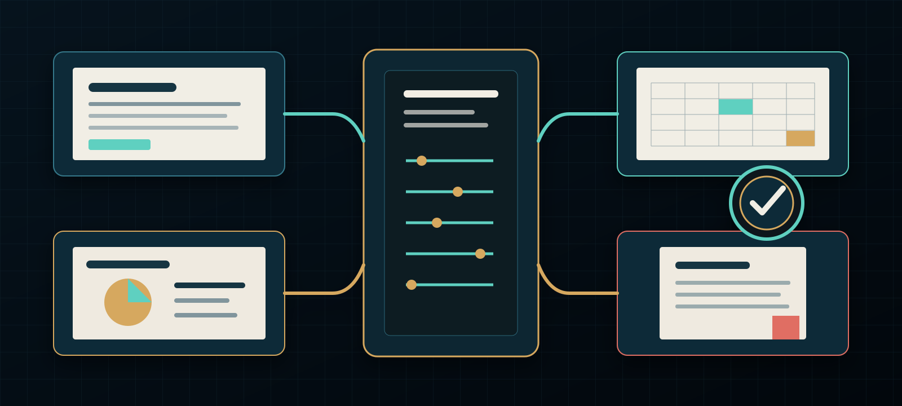

  

# Owen Burnett Officecraft

> Bring the rough notes. Leave with an office packet that still agrees with itself.

Owen Burnett Officecraft turns workplace material into coherent documents, presentations, spreadsheets, PDFs, and coordinated deliverable families. It combines a production operator, an independent reviewer, and a resumable Officefile that keeps sources, facts, derivatives, checks, and authority distinct.

**[Explore the product site](https://stunspot.github.io/owen-burnett-officecraft/)** | **[Download v0.1.0](https://github.com/Stunspot/owen-burnett-officecraft/releases/tag/v0.1.0)** | **[Run a first job](docs/FIRST-JOB.md)**

Officecraft is for operators, analysts, executive assistants, consultants, project leads, researchers, and teams that need finished office work without letting a memo, deck, workbook, and PDF become four competing versions of the truth.

## What the product does

Officecraft:

- routes a request to the smallest useful document, deck, workbook, PDF, or coordinated artifact family;
- identifies audience, use moment, editable source, derivative relationship, source authority, privacy boundary, and approval owner;
- governs consequential names, dates, figures, units, recommendations, and requested actions through one content spine;
- uses format-specific document, presentation, spreadsheet, and PDF craft rather than cloning prose across file types;
- preserves substantial work in a resumable Officefile with sources, brief, ledger, artifact register, decisions, outputs, review, and handoff;
- selects only host capabilities observed in the current run and degrades to a complete production packet when file tooling is absent;
- separates produced, structurally checked, visually inspected, native-verified, reviewed, approved, and externally delivered states;
- challenges the finished handoff through the separately installable Officecraft Reviewer.

## What it cannot do by itself

The release contains no office application, renderer, model provider, connected account, cloud store, automatic updater, telemetry service, or external-delivery service. It cannot guarantee host discovery, template fidelity, formula recalculation, visual quality, accessibility, metadata removal, source truth, privacy in the surrounding host, approval, or delivery.

A requested DOCX, PPTX, XLSX, or PDF exists only when a compatible route actually creates it. A structural inspection does not prove page layout. A reviewer verdict does not authorize sending, publishing, sharing, uploading, or overwriting anything.

Read [Trust, privacy, network behavior, and limits](docs/TRUST-PRIVACY-AND-LIMITS.md).

## Install both matched skills

The repository and release contain two separate skills:

- `codex/owen-burnett-officecraft/` - production operator;
- `codex/officecraft-reviewer/` - independent reviewer;
- `claude/owen-burnett-officecraft-v0.1.0.zip` - Claude operator archive;
- `claude/officecraft-reviewer-v0.1.0.zip` - Claude reviewer archive.

Use [Install in Codex](docs/INSTALL-CODEX.md) or [Install in Claude](docs/INSTALL-CLAUDE.md). Keep the operator and reviewer on the same version, start a fresh host task, verify discovery, invoke the operator explicitly, and use a small low-risk request before consequential work.

Folder presence or archive upload proves only placement. The [host matrix](HOST-MATRIX.md) and [readiness guide](docs/VERIFICATION-AND-READINESS.md) preserve the current evidence boundary.

## Begin successfully

Try:

> Use Owen Burnett Officecraft. Turn these meeting notes into a concise decision memo for leadership. Preserve supplied facts, show unresolved conflicts, and leave me with an editable source plus a delivery-ready PDF if the active host supports both. Do not upload, email, publish, or overwrite anything.

A successful handoff names:

- the audience, use moment, source authority, assumptions, and privacy boundary;
- the requested artifacts and the canonical editable source;
- every file actually produced and its location;
- the relationship between editable sources and derivatives;
- checks actually run and surfaces still untested;
- unresolved conflicts, approval owner, and next authorized action.

When compatible file tooling is absent, the honest result is a source-ready production packet—not an imaginary office file. See [Your first Officecraft job](docs/FIRST-JOB.md).

## Representative workflows

- Convert notes and source documents into an editable decision memo and a PDF derivative.
- Build a paced decision deck from an approved narrative spine and evidence set.
- Create an auditable workbook whose figures feed a brief and deck without semantic drift.
- Resume a multi-artifact packet through its Officefile after interruption or revision.
- Review a supplied packet independently and return PASS, PASS_WITH_CONDITIONS, REVISE, or BLOCKED.

## Customer journey

| Need | Go here |
|---|---|
| Choose a host and first route | [Start here](START-HERE.md) |
| Install on Codex | [Install in Codex](docs/INSTALL-CODEX.md) |
| Install on Claude | [Install in Claude](docs/INSTALL-CLAUDE.md) |
| Produce a first deliverable | [First job](docs/FIRST-JOB.md) |
| Pause, resume, validate, inspect, or package substantial work | [Officefile and resume](docs/OFFICEFILE-AND-RESUME.md) |
| Understand host and evidence states | [Host capabilities and evidence](docs/HOST-CAPABILITIES-AND-EVIDENCE.md) |
| Recover from a missing route or stale derivative | [Troubleshooting](docs/TROUBLESHOOTING.md) |
| Update, remove, roll back, or clean up data | [Lifecycle](docs/LIFECYCLE.md) |
| Understand privacy, storage, network, and security boundaries | [Trust and limits](docs/TRUST-PRIVACY-AND-LIMITS.md) |
| Use or review accessible artifacts | [Accessibility](docs/ACCESSIBILITY.md) |
| Inspect validation and evidence status | [Verification and readiness](docs/VERIFICATION-AND-READINESS.md) |
| Understand lineage and rights | [Provenance and licensing](docs/PROVENANCE-AND-LICENSING.md) |
| Get help or report a vulnerability | [Support](SUPPORT.md) and [Security](SECURITY.md) |
| Contribute | [Contributing](CONTRIBUTING.md) |

## Evidence status

Observed in the retained v0.1.0 release evidence:

- all 16 Officefile unit tests passed;
- both skills passed deterministic Codex and Claude package validation;
- the operator's 14-case and reviewer's 6-case evaluation suites passed structural validation;
- 17 customer Markdown files passed structural accessibility lint;
- three bounded operator and three bounded reviewer context-only smoke cases were each judged DEMONSTRATED once.

Not established: fresh-host Codex or Claude installation, discovery, or invocation; native Office automation; formula recalculation; cloud connection; broad reliability; representative-user success; formal accessibility conformance; external delivery.

## Support, license, and custody

Use [GitHub Issues](https://github.com/Stunspot/owen-burnett-officecraft/issues) for sanitized reproducible defects. Do not attach customer files, private Officefiles, credentials, account exports, proprietary templates, or unredacted evidence. Security-sensitive reports follow [SECURITY.md](SECURITY.md).

Officecraft is MIT-licensed. Third-party applications, services, templates, brand assets, and user-supplied material retain their own terms. Publication does not imply marketplace submission, host approval, installation, account connection, or permission to use a customer's material.